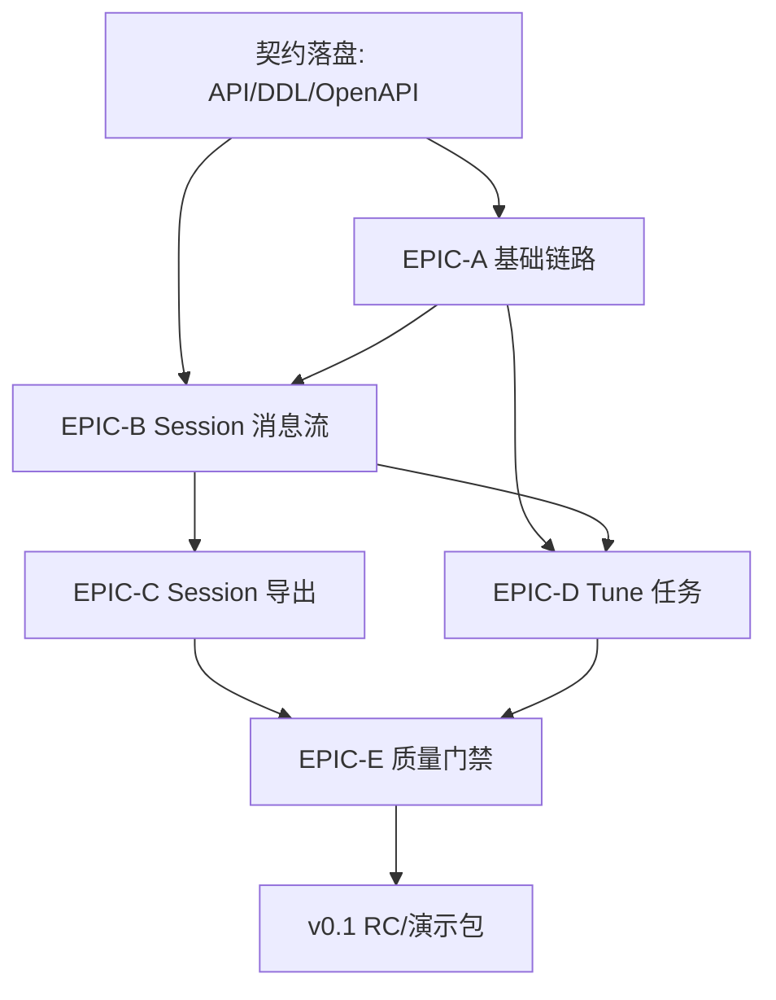

# Mely AI v0.1 里程碑与 Jira 任务拆解（可执行版）

> 版本：v0.1（面向可演示、可验收的最小闭环）  
> 生成时间：2026-03-13（GMT+8）  
> 目标窗口：即日起至 2026-03-16

---

## 1) v0.1 目标与范围

基于现有执行计划，v0.1 以 **P0 闭环优先**，确保以下主链路在 3/16 前可联调演示：

1. Auth + Project + Model 基础链路可用
2. Session 对话与消息流可跑通
3. Session 导出样本可产出
4. Tune 任务（创建/状态/日志）可追踪

**范围外（v0.1 不承诺上线）**：
- Asset 审核发布、Library 安装归档、Billing 可视化（归入 Sprint 2/P1）

---

## 2) 里程碑定义（Milestones）

### M0：契约落盘完成（3/13）
- API/数据契约清单落盘
- DB DDL 草案落盘
- OpenAPI YAML 草案落盘
- 产出：可供前后端并行开发的基线

### M1：核心服务可联调（3/14）
- Auth/Project/Model 接口可用
- Session 基础收发链路可用
- FE 完成最小页面骨架并接入 Mock/真实 API
- 产出：主链路 Happy Path 首次贯通

### M2：P0 功能闭环（3/15）
- Session 导出样本可用
- Tune 任务创建/状态/日志端到端跑通
- QA 完成 P0 核心用例首轮通过
- 产出：可演示的 v0.1 Beta

### M3：发布候选（RC）与演示包（3/16）
- 缺陷收敛（P0=0、P1 可控）
- 回归通过 + 演示脚本/发布清单齐备
- 产出：v0.1 RC 演示版

---

## 3) Jira 结构建议（Epic → Story → Task）

## EPIC-A：平台基础链路（Auth/Project/Model）
**验收标准（DoD）**：
- 用户可鉴权登录
- 可创建并查看 Project
- 可绑定/查看 Model 基础信息
- API 契约与前端字段一致，错误码语义一致

### Story A1：Auth 最小可用
- A1-1（BE）实现登录/鉴权中间件与 token 校验
- A1-2（FE）登录态接入与失效处理
- A1-3（QA）鉴权正常/失效/越权测试

### Story A2：Project 管理
- A2-1（BE+DB）Project 表与 CRUD 接口
- A2-2（FE）Project 列表/创建页面
- A2-3（QA）Project CRUD 用例与权限校验

### Story A3：Model 基础信息
- A3-1（BE+DB）Model 元数据表与接口
- A3-2（FE）Model 绑定与详情展示
- A3-3（QA）输入校验与错误码验证

---

## EPIC-B：Session 对话与消息流
**DoD**：
- Session 可创建、发送消息、拉取消息列表
- 消息时序正确、基础错误处理可观测

### Story B1：Session 生命周期
- B1-1（BE+DB）Session/Message 表与写入流程
- B1-2（BE）消息查询接口（分页/排序）
- B1-3（FE）会话列表与消息窗口基础交互

### Story B2：对话链路稳定性
- B2-1（BE）超时/重试/错误语义统一
- B2-2（FE）发送失败提示与重试入口
- B2-3（QA）弱网/异常场景测试

---

## EPIC-C：Session 导出样本
**DoD**：
- 用户可选择 Session 导出样本文件
- 导出状态可追踪，产物可下载/校验

### Story C1：导出能力
- C1-1（BE）导出任务创建接口
- C1-2（BE）导出文件生成与存储策略（本地/云边界可见）
- C1-3（FE）导出按钮、进度与结果反馈
- C1-4（QA）导出内容完整性与权限验证

---

## EPIC-D：Tune 任务闭环
**DoD**：
- 可发起 Tune 任务
- 可查询状态与日志
- 关键操作可追踪/审计

### Story D1：Tune 任务管理
- D1-1（BE+DB）TuneTask 表与创建接口
- D1-2（Model）训练编排适配（最小可跑通）
- D1-3（BE）状态机与日志聚合接口
- D1-4（FE）Tune 任务页（创建/状态/日志）
- D1-5（QA）状态流转与异常恢复测试

---

## EPIC-E：质量与发布门禁
**DoD**：
- P0 用例通过率达标
- 发布清单与演示脚本齐备

### Story E1：测试与回归
- E1-1（QA）P0 回归矩阵（Auth/Project/Session/Export/Tune）
- E1-2（全员）缺陷分级与修复 SLA
- E1-3（PM）验收打分与范围锁定

### Story E2：发布准备
- E2-1（PM）演示脚本（3 条主流程）
- E2-2（Delivery）风险清单与回滚预案
- E2-3（全员）RC 评审会与 Go/No-Go 结论

---

## 4) 关键依赖图（Dependency Graph）

**关键阻塞点**：
1. M0 未完成会阻塞前后端并行（高风险）
2. Session 数据模型若反复修改，会连锁影响导出与 Tune（高风险）
3. Tune 状态机定义不稳定会导致 FE/QA 返工（中高风险）

---

## 5) 3/16 前排期（按日可执行）

## 3/13（D0，今天）— 目标：完成 M0
- PM：冻结 v0.1 范围与验收标准（仅 P0）
- BE/DB：完成 API 契约清单 + DDL 草案 + OpenAPI 草案落盘
- FE：按契约搭页面骨架，建立 API Client
- QA：产出 P0 用例框架与测试数据计划
- 出口条件：M0 达成；若契约未冻结，3/14 开发不启动

## 3/14（D1）— 目标：完成 M1
- BE/DB：Auth/Project/Model + Session 基础接口联调
- FE：登录/Project/Session 主页面可跑通
- Model：Tune 最小任务入口可回执
- QA：主链路 Happy Path 首轮验证
- 出口条件：主链路首次端到端成功

## 3/15（D2）— 目标：完成 M2
- BE：完成导出能力与 Tune 状态/日志接口
- FE：导出与 Tune 页面交互完成
- QA：P0 回归 + 异常场景测试
- PM/Delivery：缺陷分级，锁定必须修复项
- 出口条件：v0.1 Beta 可演示（允许少量 P1）

## 3/16（D3）— 目标：完成 M3
- 全员：修复 P0、收敛高优先级 P1
- QA：最终回归与验收签字
- PM：演示脚本彩排（Create→Session→Export→Tune）
- Delivery：Go/No-Go 评审、发布包归档
- 出口条件：v0.1 RC 可稳定演示

---

## 6) Jira 看板泳道与优先级建议

- 泳道：`契约基线` / `核心开发` / `联调` / `QA回归` / `发布准备`
- 优先级：`P0（阻塞里程碑）` > `P1（体验增强）` > `P2（后续迭代）`
- 状态流：`TODO → IN PROGRESS → IN REVIEW → IN QA → DONE`
- WIP 限制：每角色同时进行中的 P0 任务 ≤ 2（避免并行过载）

---

## 7) 风险与应对（简版）

1. **契约频繁变更**（高）  
   - 应对：3/13 晚冻结 v0.1 字段与错误码，新增需求走变更单
2. **Tune 链路外部依赖不稳定**（中高）  
   - 应对：预置 Mock Runner，确保前端与 QA 不被阻塞
3. **时间窗口短导致 QA 压缩**（高）  
   - 应对：从 3/14 起每日冒烟，缺陷不过夜

---

## 8) 最小验收清单（3/16）

- [ ] P0 主流程 4 条全绿：Auth/Project/Session/Export/Tune
- [ ] 关键操作可追踪（日志/状态可查）
- [ ] 已知问题清单与规避方案已记录
- [ ] 演示脚本与回滚方案完成

> 以上拆解可直接导入 Jira（按 Epic/Story/Task 建票），并以 M0→M3 作为里程碑门禁执行。