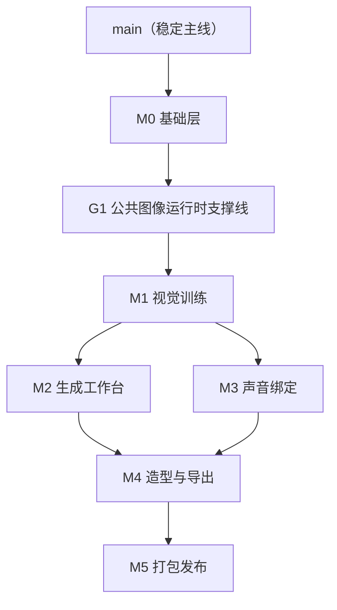

# M0-M5 Worktree Execution Blueprint

> 这份蓝图不是代码实现清单，而是后续长期执行项目时使用的“工作树地图”。
> 目标是把 M0–M5 拆成稳定的主线、模块集成线、功能叶子线，便于单人或多线程并行推进，同时尽量减少互相冲突。

## 1. 使用原则

### 1.1 固定规则

- `main` 只保留已验证、可继续往下开发的稳定结果。
- 每个模块先有一条“模块集成线”，再从它下面拆出 1–3 天粒度的“功能叶子线”。
- 每条功能叶子线固定对应：
  - 一个 Git 分支
  - 一个 worktree 目录
  - 一个独立开发线程
- 叶子线先合回模块集成线，不直接合到 `main`。
- 模块集成线通过完整验证后，再合回 `main`。
- 如果两个任务会同时修改同一批公共文件，它们就不应该并行。

### 1.2 命名约定

- 模块集成线：
  - `codex/m0a-foundation`
  - `codex/m1a-visual-training`
  - `codex/m2a-generation`
  - `codex/m3a-voice`
  - `codex/m4a-costume-export`
  - `codex/m5a-release`
- 功能叶子线：
  - `codex/m0b-shell-sidecar`
  - `codex/m1f-training-engine`
  - `codex/m2e-batch-queue`
  - 以此类推
- worktree 目录与分支后缀保持一致：
  - `.worktrees/m0b-shell-sidecar`
  - `.worktrees/m1f-training-engine`

### 1.3 创建命令模板

```bash
git worktree add .worktrees/<worktree-name> -b codex/<branch-name> <base-branch>
```

例如：

```bash
git worktree add .worktrees/m0b-shell-sidecar -b codex/m0b-shell-sidecar main
git worktree add .worktrees/m1f-training-engine -b codex/m1f-training-engine codex/m1a-visual-training
```

## 2. 总体阶段图



## 3. 特别说明：为什么有一条 G1 公共支撑线

虽然规格是按 `M0 → M1 → M2 → M3 → M4 → M5` 写的，但实际执行时有一个跨模块依赖需要提前拆出来：

- M1 的“训练中采样预览图”
- M1 的“文字创角候选图”
- M2 的整个生成工作台

这三者都依赖基础的图像生成运行时能力，也就是：

- 启动图像引擎
- 提交生成任务
- 拿回结果

如果把这部分完全等到 M2 再做，M1 后半段会被卡住。所以建议在 `M0` 之后、`M1` 之前，单独开一条公共支撑线 `G1`，只解决“最小可用图像运行时”，不要把完整生成工作台也一起做掉。

## 4. 完整工作树

### 阶段 A：M0 基础层

**模块集成线**

- 分支：`codex/m0a-foundation`
- 目录：`.worktrees/m0a-foundation`
- 基线：`main`
- 作用：承接整个项目的公共地基，不建议一开始从 `main` 同时开很多大功能线。

**功能叶子线**

| 分支 | 目录 | 基线 | 负责内容 | 依赖 |
|---|---|---|---|---|
| `codex/m0b-shell-sidecar` | `.worktrees/m0b-shell-sidecar` | `main` | Tauri + React 壳、FastAPI sidecar、health check | 无 |
| `codex/m0c-db-schema` | `.worktrees/m0c-db-schema` | `codex/m0a-foundation` | SQLite schema、migration、基础测试 | `m0b` |
| `codex/m0d-character-api` | `.worktrees/m0d-character-api` | `codex/m0a-foundation` | Character CRUD API | `m0c` |
| `codex/m0e-storage-paths` | `.worktrees/m0e-storage-paths` | `codex/m0a-foundation` | `~/.mely/` 目录结构、角色文件夹管理 | `m0d` |
| `codex/m0f-task-queue` | `.worktrees/m0f-task-queue` | `codex/m0a-foundation` | asyncio 任务队列、任务状态、进度推送框架 | `m0b` |
| `codex/m0g-downloader` | `.worktrees/m0g-downloader` | `codex/m0a-foundation` | 按需下载、断点续传、校验、持久化 | `m0f` |
| `codex/m0h-library-home` | `.worktrees/m0h-library-home` | `codex/m0a-foundation` | 角色库首页空壳、列表、空状态 | `m0d` |

**执行建议**

- `m0b` 先做，验证“桌面应用 + 后端服务”真的能一起启动。
- `m0c`、`m0f` 可以在 `m0b` 稳定后分线推进。
- `m0d` 和 `m0h` 不要早于 `m0c`。
- `m0g` 必须等 `m0f` 的任务和进度机制基本确定。

**M0 合回 `main` 的门槛**

- 应用能启动
- 前后端能通信
- 数据库能初始化
- Character CRUD 可跑通
- 通用任务进度可显示
- 下载器能断点续传
- 角色库首页可展示数据

### 阶段 B：G1 公共图像运行时支撑线

**模块集成线**

- 分支：`codex/g1-image-runtime`
- 目录：`.worktrees/g1-image-runtime`
- 基线：`main`（要求 M0 已合并）
- 作用：给 M1 后半段和 M2 提供最小可用的图像生成底座。

**功能叶子线**

| 分支 | 目录 | 基线 | 负责内容 | 依赖 |
|---|---|---|---|---|
| `codex/g1b-engine-manager` | `.worktrees/g1b-engine-manager` | `codex/g1-image-runtime` | 图像引擎进程生命周期、健康检查、崩溃重启 | M0 已完成 |
| `codex/g1c-engine-bridge` | `.worktrees/g1c-engine-bridge` | `codex/g1-image-runtime` | 提交任务、接收进度、取回生成文件 | `g1b` |
| `codex/g1d-preview-contract` | `.worktrees/g1d-preview-contract` | `codex/g1-image-runtime` | 给训练采样图和候选图使用的统一接口 | `g1c` |

**G1 合回 `main` 的门槛**

- 可无头启动图像引擎
- 可提交最简单的文生图任务
- 可拿回结果图
- 可供 M1 调用来生成训练采样预览

### 阶段 C：M1 视觉训练

**模块集成线**

- 分支：`codex/m1a-visual-training`
- 目录：`.worktrees/m1a-visual-training`
- 基线：`main`（要求 M0、G1 已合并）

**功能叶子线**

| 分支 | 目录 | 基线 | 负责内容 | 依赖 |
|---|---|---|---|---|
| `codex/m1b-flux-poc` | `.worktrees/m1b-flux-poc` | `codex/m1a-visual-training` | 3070 8GB 上的模型 PoC 与结论文档 | M0 |
| `codex/m1c-dataset-import` | `.worktrees/m1c-dataset-import` | `codex/m1a-visual-training` | 数据集导入、预览、质量评分 | M0 |
| `codex/m1d-wd14-tagging` | `.worktrees/m1d-wd14-tagging` | `codex/m1a-visual-training` | WD14 打标、标签建议值 | M0 下载器 |
| `codex/m1e-dna-editor` | `.worktrees/m1e-dna-editor` | `codex/m1a-visual-training` | DNA 表单、自动 Prompt 预览、保存 | `m1d` |
| `codex/m1f-training-engine` | `.worktrees/m1f-training-engine` | `codex/m1a-visual-training` | AI-Toolkit 训练封装、模式配置、GPU 互斥 | `m1b`、M0 队列 |
| `codex/m1g-training-progress` | `.worktrees/m1g-training-progress` | `codex/m1a-visual-training` | 训练进度 UI、采样预览展示 | `m1f`、G1 |
| `codex/m1h-text-character` | `.worktrees/m1h-text-character` | `codex/m1a-visual-training` | 文字创角候选图 → 进入数据集流程 | G1、`m1c` |
| `codex/m1i-validation-retrain` | `.worktrees/m1i-validation-retrain` | `codex/m1a-visual-training` | 验证图、满意度、重训建议、一键重训 | `m1f`、`m1g` |

**执行建议**

- `m1b`、`m1c`、`m1d` 可以较早并行。
- `m1f` 必须等 PoC 结论，否则训练模式和默认模型会反复变。
- `m1g`、`m1h`、`m1i` 都依赖 G1。

**M1 合回 `main` 的门槛**

- 导图、打标、DNA、训练、进度、验证、重训全链路可跑通
- 3070 8GB 的默认训练模式已锁定
- VRAM 不足等错误提示已经是中文自然语言

### 阶段 D：M2 生成工作台

**模块集成线**

- 分支：`codex/m2a-generation`
- 目录：`.worktrees/m2a-generation`
- 基线：`main`（要求 M1 已合并）

**功能叶子线**

| 分支 | 目录 | 基线 | 负责内容 | 依赖 |
|---|---|---|---|---|
| `codex/m2b-engine-runtime` | `.worktrees/m2b-engine-runtime` | `codex/m2a-generation` | 完整图像引擎管理、健康检查、自动重启 | G1 |
| `codex/m2c-prompt-assembler` | `.worktrees/m2c-prompt-assembler` | `codex/m2a-generation` | 场景 Prompt + DNA + LoRA + 造型规则合并 | M1 |
| `codex/m2d-single-generate-ui` | `.worktrees/m2d-single-generate-ui` | `codex/m2a-generation` | 单张生成主界面 | `m2b`、`m2c` |
| `codex/m2e-batch-queue` | `.worktrees/m2e-batch-queue` | `codex/m2a-generation` | 批量生成、排队、完成通知 | M0 队列、`m2b` |
| `codex/m2f-generation-archive` | `.worktrees/m2f-generation-archive` | `codex/m2a-generation` | generations 入库、参数快照、文件归档 | `m2d` |
| `codex/m2g-fallback-engine` | `.worktrees/m2g-fallback-engine` | `codex/m2a-generation` | fallback 备用图像引擎 | `m2b` |
| `codex/m2h-gallery-history` | `.worktrees/m2h-gallery-history` | `codex/m2a-generation` | 图库浏览、筛选、复用参数重生 | `m2f` |

**M2 合回 `main` 的门槛**

- 单张生成可用
- 批量生成可排队
- 结果自动归档
- 历史图库可浏览
- 图像引擎崩溃后可恢复或切换备用模式

### 阶段 E：M3 声音绑定

**模块集成线**

- 分支：`codex/m3a-voice`
- 目录：`.worktrees/m3a-voice`
- 基线：`main`（要求 M1 已合并，可与 M2 并行）

**功能叶子线**

| 分支 | 目录 | 基线 | 负责内容 | 依赖 |
|---|---|---|---|---|
| `codex/m3b-tts-runtime` | `.worktrees/m3b-tts-runtime` | `codex/m3a-voice` | TTS 引擎下载、推理服务、GPU 互斥 | M0 下载器 |
| `codex/m3c-voice-binding` | `.worktrees/m3c-voice-binding` | `codex/m3a-voice` | 参考音频上传、声纹提取、绑定存储 | `m3b` |
| `codex/m3d-voice-ui` | `.worktrees/m3d-voice-ui` | `codex/m3a-voice` | 上传、波形、试听、确认绑定 | `m3c` |
| `codex/m3e-tts-generate` | `.worktrees/m3e-tts-generate` | `codex/m3a-voice` | 输入文字 → 合成 → 导出 | `m3b`、`m3d` |
| `codex/m3f-audio-archive` | `.worktrees/m3f-audio-archive` | `codex/m3a-voice` | 音频入库、历史回放、参数快照 | `m3e` |

**M3 合回 `main` 的门槛**

- 角色可绑定声音
- 可试听和确认
- 可生成 TTS
- 音频可归档和历史回放

### 阶段 F：M4 造型与导出

**模块集成线**

- 分支：`codex/m4a-costume-export`
- 目录：`.worktrees/m4a-costume-export`
- 基线：`main`（要求 M2、M3 已合并）

**功能叶子线**

| 分支 | 目录 | 基线 | 负责内容 | 依赖 |
|---|---|---|---|---|
| `codex/m4b-costume-api` | `.worktrees/m4b-costume-api` | `codex/m4a-costume-export` | 造型 CRUD、树结构接口 | M2 |
| `codex/m4c-costume-branch-flow` | `.worktrees/m4c-costume-branch-flow` | `codex/m4a-costume-export` | 自然语言差异描述、预览生成、确认保存 | `m4b`、M2 |
| `codex/m4d-version-tree-ui` | `.worktrees/m4d-version-tree-ui` | `codex/m4a-costume-export` | 版本树可视化与交互 | `m4b` |
| `codex/m4e-export-aggregate` | `.worktrees/m4e-export-aggregate` | `codex/m4a-costume-export` | 设定书 JSON 数据聚合 | M1、M2、M3 |
| `codex/m4f-pdf-export` | `.worktrees/m4f-pdf-export` | `codex/m4a-costume-export` | PDF 设定书导出 | `m4e` |
| `codex/m4g-proof-chain` | `.worktrees/m4g-proof-chain` | `codex/m4a-costume-export` | 创作时间戳、哈希链、证明导出 | M1、M2、M3 已稳定 |
| `codex/m4h-lora-encryption` | `.worktrees/m4h-lora-encryption` | `codex/m4a-costume-export` | LoRA 加密存储、加载时透明解密 | M1 训练资产路径已稳定 |

**执行建议**

- `m4g` 和 `m4h` 不要太早开，因为它们都会回头接触之前已经完成的系统。
- `m4c` 依赖 M2 的生成底座稳定，否则预览流会反复变。

**M4 合回 `main` 的门槛**

- 造型分支可创建、切换、删除
- 设定书可导出为中文正常显示的 PDF
- 时间戳链可导出并验证
- LoRA 文件本地加密可正常加载

### 阶段 G：M5 打包发布

**模块集成线**

- 分支：`codex/m5a-release`
- 目录：`.worktrees/m5a-release`
- 基线：`main`（要求 M4 已合并）

**功能叶子线**

| 分支 | 目录 | 基线 | 负责内容 | 依赖 |
|---|---|---|---|---|
| `codex/m5b-windows-packager` | `.worktrees/m5b-windows-packager` | `codex/m5a-release` | Windows 安装包、启动、卸载行为 | M0–M4 |
| `codex/m5c-first-launch` | `.worktrees/m5c-first-launch` | `codex/m5a-release` | 首次启动引导、按需下载、断点续传接入 | `m5b`、M0 下载器 |
| `codex/m5d-gpu-resource` | `.worktrees/m5d-gpu-resource` | `codex/m5a-release` | GPU 检测、VRAM 推荐、运行时占用显示 | M0–M4 |
| `codex/m5e-onboarding` | `.worktrees/m5e-onboarding` | `codex/m5a-release` | 新手引导，串起创建角色→训练→生成 | M1、M2、M3 |
| `codex/m5f-settings-error-copy` | `.worktrees/m5f-settings-error-copy` | `codex/m5a-release` | 设置页、所有用户可见错误文案中文化 | M0–M4 |
| `codex/m5g-user-test-fixes` | `.worktrees/m5g-user-test-fixes` | `codex/m5a-release` | 用户测试后的 P0/P1 修复与细节打磨 | `m5b`–`m5f` 进入冻结后 |

**M5 合回 `main` 的门槛**

- 干净 Windows 机器可安装可启动
- 首次下载和准备流程可跑通
- 新手用户能在引导下完成第一次创作
- 所有用户可见错误都已中文化
- 用户测试中的 P0 问题全部清零

## 5. 推荐执行节奏

### Wave 0

- 完成 `M0`

### Wave 1

- 完成 `G1`
- 同时准备 `M1` 早期叶子线（PoC、导图、打标）

### Wave 2

- 收口 `M1`

### Wave 3

- `M2` 与 `M3` 并行

### Wave 4

- 完成 `M4`

### Wave 5

- 完成 `M5`

## 6. 每条线的统一执行动作

### 开始前

- 从正确的基线创建 worktree
- 在线程开头先读：
  - `docs/PROJECT_CONTEXT.md`
  - 对应模块 spec
  - 涉及界面时再读 `prototypes/mely-unified.jsx`
  - 涉及具体页面时再读对应原型文件

### 开发中

- 控制范围，只做该叶子线负责的内容
- 先验证依赖线已经稳定
- 一旦发现会改到别人的公共文件，优先回收到模块集成线统一处理

### 合并前

- 自己先跑一遍对应主路径
- 确认错误提示是中文自然语言
- 确认没有把无关改动带进来
- 先合回模块集成线，再做一次集成验证

### 收尾

- 叶子线合并后关闭对应 worktree
- 模块集成线合并到 `main` 后，再统一开启下一波叶子线

## 7. 第一批就可以执行的内容

当前仓库已经存在：

- 分支：`codex/m0a-foundation`
- 目录：`.worktrees/m0a-foundation`

因此最实际的下一步是：

1. 先把 `m0a-foundation` 作为 M0 集成线固定下来。
2. 优先补出 `m0b-shell-sidecar`。
3. 等应用壳和 sidecar 稳定后，再拆 `m0c-db-schema`、`m0f-task-queue`。
4. 再往后拆 `m0d-character-api`、`m0g-downloader`、`m0h-library-home`。

不要一开始同时开完整的 M1–M5 空分支。正确做法是：

- 只提前定义好整张地图
- 只创建“下一波马上要做”的 worktree
- 每一波合并回主线后，再开启下一波

这样最省冲突，也最不容易留下大量长期漂浮、没人收口的空分支。
