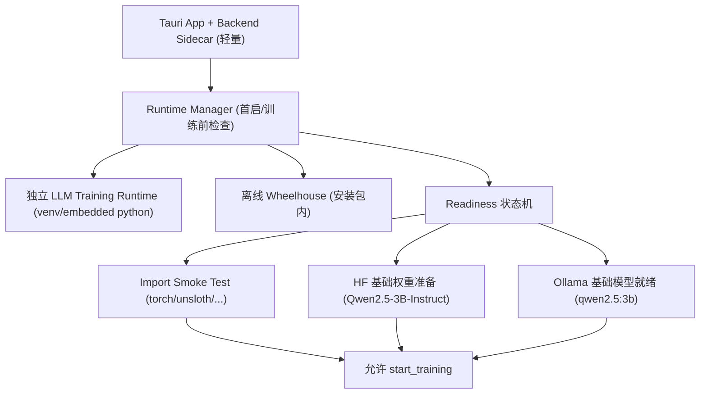
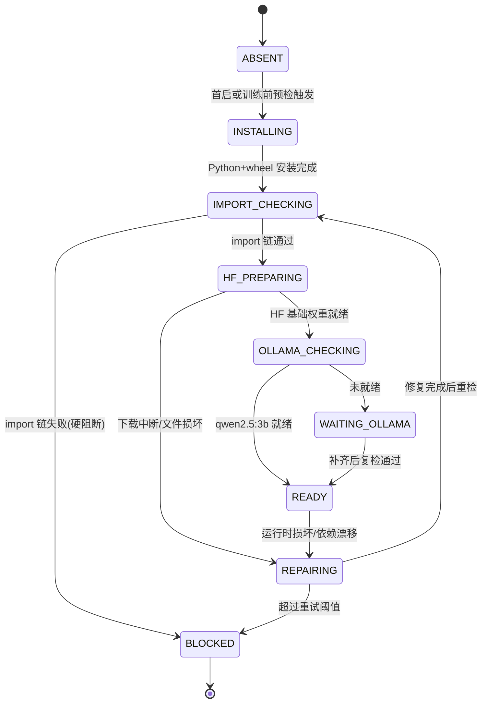
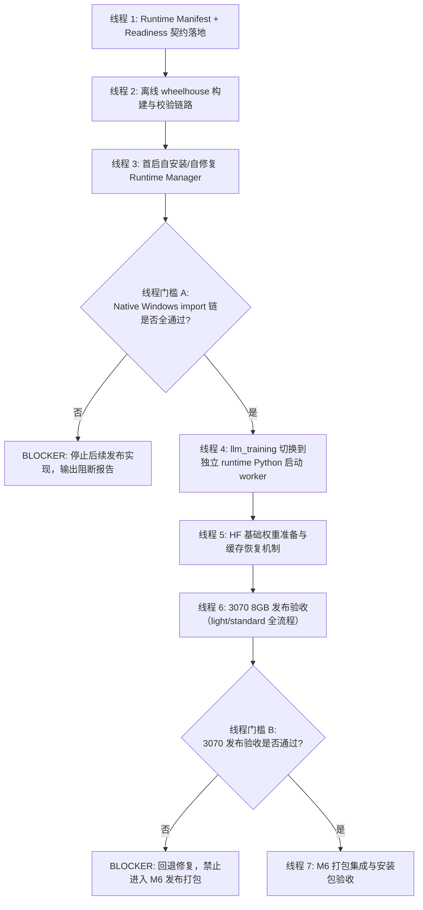

# 2026-04-14 M1 Windows LLM 训练 Runtime 发布级设计锁定

## 0. 结论先行（本次锁定）

本次先锁定发布架构，不做大规模代码改造。核心决策如下：

1. **训练运行时必须独立于主 backend sidecar**（独立 Python 环境，独立依赖生命周期）。
2. **训练依赖通过离线 wheelhouse 交付**（不依赖用户手动 `pip install`）。
3. **应用首启执行自安装 / 自修复**（可恢复中断、坏包、丢依赖）。
4. **发布验收第一优先级是 native Windows import 链**：`torch / unsloth / datasets / transformers / trl` 必须全部导入成功；否则直接判定 **Blocker**，停止后续发布实现。
5. **发布硬件口径固定为 RTX 3070 8GB**；RTX 5060 16GB 仅用于开发验证，不得替代发布门槛。
6. **默认训练基础模型为 `qwen2.5:3b`**，且训练链路除 Ollama 模型外，必须准备 HuggingFace 训练基础权重（`Qwen/Qwen2.5-3B-Instruct`）。

---

## 1. 为什么推荐「独立 runtime + 离线 wheelhouse + 首启自安装/自修复」

### 1.1 不把训练依赖塞进主 sidecar 的根因

当前训练 worker 由主进程通过 `sys.executable` 拉起，天然绑定 sidecar Python 环境；一旦 sidecar 内缺 `unsloth/torch`，训练必失败。
把大依赖直接塞进 sidecar 会带来发布级问题：

- sidecar 体积和冷启动成本暴涨；
- 任何训练依赖变更都要重打整个 backend，可维护性差；
- 主业务 API 与 GPU 大依赖耦合，故障隔离能力弱；
- PyInstaller 对重 GPU 栈打包稳定性和可重复性较差；
- 自修复困难（用户机器缺模块时无法单独修复训练栈）。

### 1.2 推荐方案的收益

1. **稳定性**：主 API 进程保持轻量，训练栈损坏不拖垮主服务。
2. **可运维**：训练运行时可单独版本化、回滚、修复。
3. **可发布**：依赖通过 wheelhouse 固定版本 + 哈希校验，避免“这台机器能跑那台不能跑”。
4. **用户体验**：用户不需要手动装 Python / torch / unsloth，首启自动准备，失败自动修复。
5. **离线友好**：依赖安装无需联网 PyPI，可在弱网/内网场景稳定完成。

---

## 2. 推荐架构总览（Windows）



---

## 3. 目录结构（发布建议）

> 说明：`%USERPROFILE%\\.mely` 为现有数据根目录口径。

### 3.1 安装包资源（只读）

```text
MelyAI/
  src-tauri/resources/
    mely-backend/                         # 轻量 sidecar（不含 torch/unsloth）
    llm-runtime/
      runtime-manifest.template.json      # 运行时契约模板
      requirements-lock.txt               # 固定依赖版本清单
      python/
        python-3.11.x-embed-amd64.zip     # 嵌入式 Python（或等价离线 Python 分发）
      wheelhouse/
        win_amd64_cu121/
          *.whl                           # torch/unsloth/datasets/transformers/trl 及闭包依赖
          SHA256SUMS.txt
      tools/
        bootstrap_runtime.py              # 首启安装/修复
        verify_import_chain.py            # import smoke test
```

### 3.2 用户数据区（可写）

```text
%USERPROFILE%\.mely/
  runtimes/
    llm/
      llm-win-cu121-py311-v1/
        python/                           # 实际可执行 python
        venv/
          Scripts/python.exe              # 训练 worker 专用解释器
        install/
          install.log
          last_error.json
        manifest.runtime.json             # 实例化后的 runtime manifest
  cache/
    hf/
      models--Qwen--Qwen2.5-3B-Instruct/ # HuggingFace snapshot cache
  characters/
    {character_id}/
      llm_training_runs/{job_id}/         # worker config/log/checkpoint
      llm_adapters/{job_id}/
      llm_models/{job_id}/
```

---

## 4. Runtime Manifest 契约（强约束）

manifest 作为训练 runtime 的单一真相来源（SSOT），由 Runtime Manager 读写。

### 4.1 JSON 示例

```json
{
  "schemaVersion": 1,
  "runtimeId": "llm-win-cu121-py311-v1",
  "platform": {
    "os": "windows",
    "arch": "x86_64",
    "cuda": "12.1"
  },
  "python": {
    "version": "3.11.9",
    "exePath": "%USERPROFILE%/.mely/runtimes/llm/llm-win-cu121-py311-v1/venv/Scripts/python.exe"
  },
  "dependencySet": {
    "lockFile": "requirements-lock.txt",
    "wheelhouse": "win_amd64_cu121",
    "packages": [
      {"name": "torch", "version": "locked", "wheel": "torch-*.whl", "sha256": "required"},
      {"name": "unsloth", "version": "locked", "wheel": "unsloth-*.whl", "sha256": "required"},
      {"name": "datasets", "version": "locked", "wheel": "datasets-*.whl", "sha256": "required"},
      {"name": "transformers", "version": "locked", "wheel": "transformers-*.whl", "sha256": "required"},
      {"name": "trl", "version": "locked", "wheel": "trl-*.whl", "sha256": "required"}
    ]
  },
  "importSmokeTest": ["torch", "unsloth", "datasets", "transformers", "trl"],
  "baseModels": [
    {
      "ollamaTag": "qwen2.5:3b",
      "huggingfaceModelId": "Qwen/Qwen2.5-3B-Instruct",
      "required": true
    }
  ],
  "hardwarePolicy": {
    "releaseBaseline": "product_8gb",
    "validationOnly": "validation_16gb"
  },
  "readiness": {
    "state": "NOT_READY",
    "lastCheckedAt": null,
    "repairCount": 0,
    "lastErrorCode": null
  }
}
```

### 4.2 契约规则

1. `python.exe` 路径必须指向独立 runtime，不允许回落到 sidecar `sys.executable`。
2. `dependencySet.packages` 必须带哈希校验，安装前后均做校验。
3. `importSmokeTest` 全通过后才允许进入 `READY`。
4. `baseModels` 同时约束 Ollama tag 与 HuggingFace 训练权重来源。
5. `readiness.state != READY` 时，训练 API 必须拒绝执行并返回可读中文错误。

---

## 5. Readiness 状态机



### 5.1 硬规则

- `BLOCKED` 是发布阻断态：只要 import 链失败，必须停在这里，不得继续后续发布实现。
- `READY` 之前，`/api/llm-training/start` 只能返回阻断错误，不得“试试看能不能跑”。

---

## 6. 安装包内 / 首启自动准备边界（必须明确）

### 6.1 必须进安装包（C1）

1. 轻量 backend sidecar（不含 torch/unsloth）。
2. Runtime Manager + bootstrap/repair 工具脚本。
3. runtime manifest 模板 + requirements lock。
4. 离线 wheelhouse（含 `torch/unsloth/datasets/transformers/trl` 及闭包依赖，带 SHA256）。
5. Python 离线分发（embeddable 或等价可离线部署包）。
6. import smoke test 工具。

### 6.2 首启自动准备/下载（C2）

1. 在用户目录落地独立 runtime（解压 Python、创建 venv、离线安装 wheels）。
2. 执行 import smoke test，写入 readiness 状态。
3. 准备 Ollama 基础模型 `qwen2.5:3b`（若未就绪则自动拉取/引导）。
4. 准备 HuggingFace 训练基础权重 `Qwen/Qwen2.5-3B-Instruct`（snapshot 缓存、断点续传）。
5. 首启失败时自动修复：重试安装、校验并重建坏掉的 runtime 层。

---

## 7. 3070 8GB 发布门槛（C3）

### 7.1 发布口径（必须满足）

1. **GPU/驱动检查**：必须识别到可用 NVIDIA CUDA 环境。
2. **VRAM 门槛**：发布基线按 RTX 3070 8GB；训练模式仅允许 `light/standard`。
3. **训练前阻断**：
   - import 链失败（`torch/unsloth/...` 任一失败）；
   - runtime 未 READY；
   - HuggingFace 训练基础权重未就绪；
   - Ollama `qwen2.5:3b` 未就绪。
4. **磁盘门槛**：低于最低剩余空间阈值时阻断训练准备（避免半安装）。

### 7.2 5060 16GB 的定位（必须写明）

- RTX 5060 16GB 仅用于开发和补充验证（可覆盖 `fine` 模式验证）。
- 不可将 16GB 验证结果替代 3070 8GB 发布验收。
- 发布准入报告必须单独包含 3070 8GB native Windows 验收记录。

---

## 8. 失败场景：自动修复与中间产物保留（C4）

| 场景 | 自动修复策略 | 必须保留的中间产物 |
|---|---|---|
| wheel 安装中断（断电/杀进程） | 下次启动继续安装；必要时仅重装失败包 | `install.log`、`last_error.json` |
| wheel 校验失败（哈希不符） | 自动替换损坏 wheel；重新安装该包 | 校验报告、坏包文件名 |
| import 链失败 | 自动执行一次 runtime 重建；仍失败则 `BLOCKED` | import 日志、失败模块清单 |
| HF 权重下载中断 | 断点续传；缓存命中不重复下载 | HF cache 元数据、下载日志 |
| 训练中断/崩溃 | 任务标记失败，可从 checkpoint 续训 | `llm_training_runs/{job}/checkpoints`、`worker.log` |
| 导出 GGUF 失败 | 自动重试一次；失败保留 adapter 供后续重导 | adapter 文件、导出日志 |
| Ollama 注册失败 | 任务可标记“导出完成待注册”，支持稍后重试注册 | `gguf`、Modelfile、注册日志 |

---

## 9. 明确不推荐方案：把 torch / unsloth 打进主 PyInstaller sidecar

不推荐，且本次设计明确排除，原因：

1. 主 sidecar 与训练依赖强耦合，任何训练栈问题都会影响主服务稳定性。
2. 体积与打包复杂度不可控，发布可重复性差。
3. 训练栈无法独立升级/回滚，修复成本高。
4. 与“首启自修复”目标冲突（sidecar 坏了只能整包重装）。
5. 与现有 `mely_backend.spec` 中排除重依赖的方向冲突。

---

## 10. 训练链路的双基础模型要求（Ollama + HuggingFace）

必须明确：训练不是只要 Ollama 模型即可。

1. **推理基础**（Ollama）
   - `qwen2.5:3b` 用于对话与训练前/后对比体验。

2. **训练基础**（HuggingFace）
   - `Qwen/Qwen2.5-3B-Instruct` 用于 Unsloth `from_pretrained` 与 tokenizer。
   - 必须在 runtime READY 检查中纳入“HF 权重就绪”。

缺任一项都不得开始训练。

---

## 11. 发布验收与阻断条件（第一优先级）

### 11.1 P0 验收（必须先过）

在 **native Windows** 上，使用独立 runtime 的 Python 执行 import 链检查：

- `import torch`
- `import unsloth`
- `import datasets`
- `import transformers`
- `import trl`

全部成功才允许进入后续发布实现。

### 11.2 Blocker 定义

出现任一情况立即阻断后续发布线程：

1. import 链任一模块失败；
2. worker 仍由 sidecar `sys.executable` 执行（未切到独立 runtime）；
3. 3070 8GB 下无法稳定通过训练启动前 readiness；
4. HF 基础权重准备流程不可重试或不可恢复。

---

## 12. 风险表与阻断条件

| 风险 | 触发信号 | 影响 | 缓解方案 | 是否阻断发布 |
|---|---|---|---|---|
| 运行时依赖漂移 | 同版本机器 import 结果不一致 | 训练不可预测失败 | lock + wheel hash + manifest 校验 | 是 |
| 仅在开发机通过 | 5060 16GB 通过但 3070 失败 | 发布后核心功能不可用 | 3070 native Windows 作为准入门槛 | 是 |
| HF 权重未准备 | worker `from_pretrained` 失败 | 训练无法开始 | readiness 增加 HF_PREPARING 状态 | 是 |
| 首启安装中断 | 用户中途断网/重启 | runtime 半成品 | 断点续装 + repair 机制 | 否（可修复） |
| GGUF 导出失败 | 内存不足/导出异常 | 模型注册失败 | 保留 adapter + 支持后续重导 | 否（需告警） |
| Ollama 注册失败 | create/modelfile 失败 | 训练成果不可立即使用 | 标记“待注册”+ 重试接口 | 否（需告警） |

---

## 13. 后续线程执行顺序图（必须按门槛推进）


