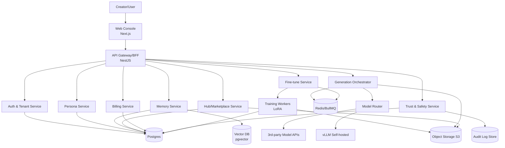
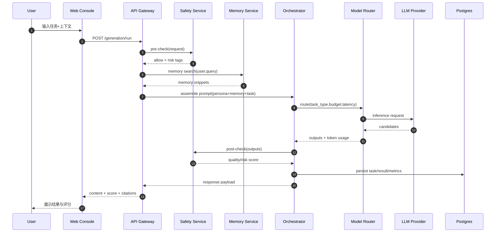
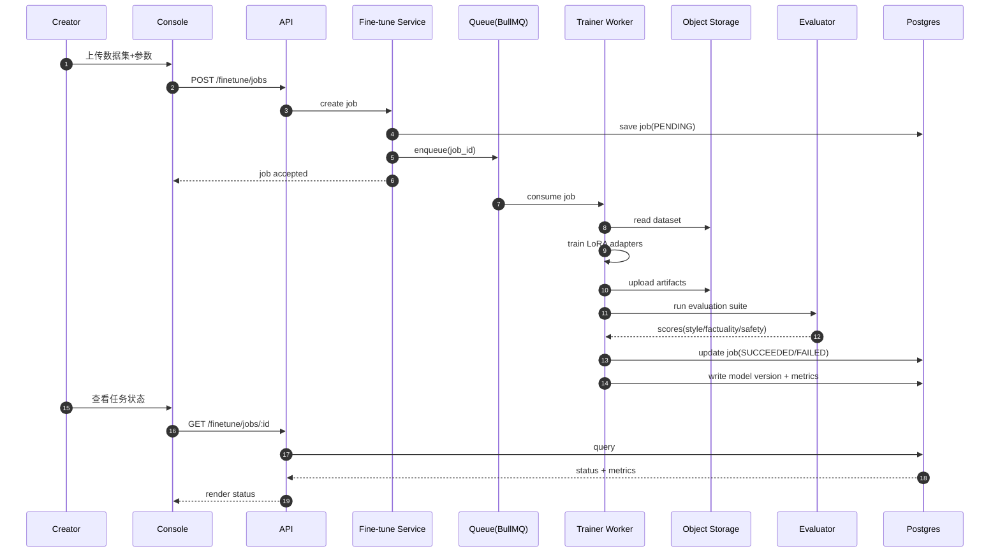
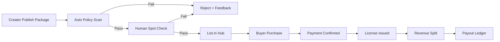
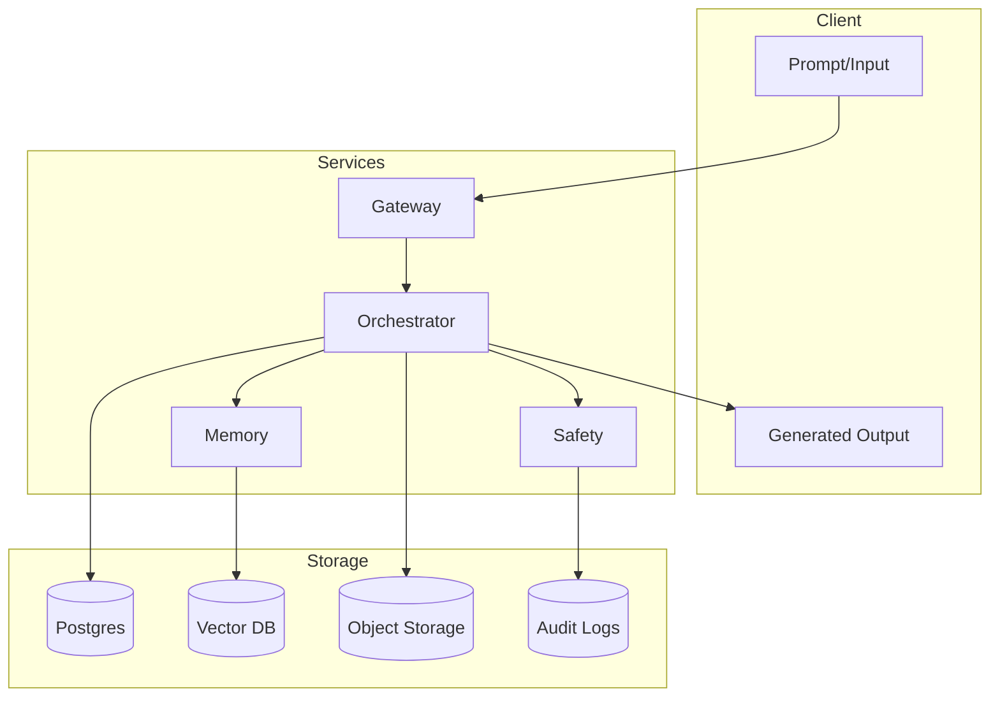

# Mely AI 技术架构图与时序（Mermaid）v1

- 版本：v1.0
- 日期：2026-03-13
- 用途：技术评审、研发对齐、实现指导

---

## 1) 系统组件图（C4-Container 简化）

---

## 2) 运行时请求链路（生成任务）

---

## 3) 微调任务时序（LoRA）

---

## 4) 发布与交易流程（模型包）

---

## 5) 关键数据流与存储边界

---

## 6) 服务 SLO 与告警阈值

- Gateway：可用性 99.9%，P95 < 250ms（不含模型推理）
- Generation API：P95 < 2.5s（轻任务），错误率 < 1%
- Fine-tune Queue：排队等待 P95 < 5min
- Payment Callback 成功率 > 99.95%
- 审核漏检率（月）< 0.5%

---

## 7) 落地建议（从图到代码）

1. 先锁定 OpenAPI（Auth/Persona/Generation/Finetune）
2. Orchestrator 先跑“单模型路由”，再扩展多模型策略
3. Safety 先做规则引擎 + 黑白名单，后续迭代分类器
4. Fine-tune 先支持单一 LoRA 模板，避免训练矩阵爆炸
5. Hub 先邀请制上架，降低审核与纠纷压力
